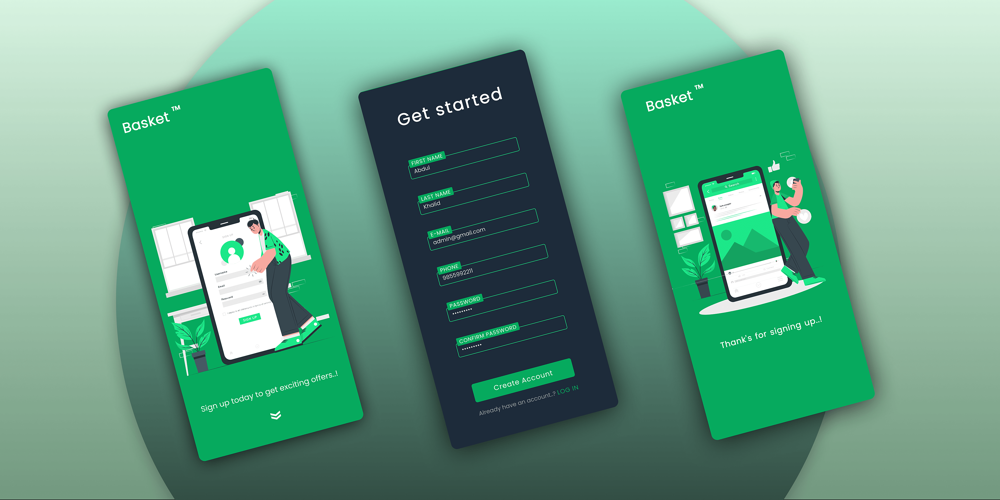

<!-- PROJECT LOGO -->

  

<h3 align="center"><b>Sign-up Form</b></h3>

  

    For a illusionary brand, Basket™
     
     

  

 

<!-- ABOUT THE PROJECT -->
## Preview

 
 

 

## Built With

-    
-    
- 

 

 

## Features

- Built with **modern Javascript** practices
- It can **evaluate the form** effectively with basic conditions
- Comes with **optimized UI** & **UX**
- **Responsive** for both **Desktop** & **Mobile**

 

## Outcome

* Used HTML5 **semantic elements** for better readability and structure
* Used CSS3 **grid** and **flex** to manage layouts
* Used **Git** and **GitHub** for project management
* Tried to maintain **clean code**
* **Cross tested** on Firefox and Chromium based browsers

 

 

<!-- ACKNOWLEDGMENTS -->
## Acknowledgments

* Inspiration by [The Odin Project](https://www.theodinproject.com/)
* Illustrative vectors was provided by [Storyset](https://www.storyset.com/)

 

<!-- LICENSE -->
## License

- Distributed under the MIT License. See `LICENSE` for more information.

 

<!-- CONTACT -->
## Credits

* Login template created by :

<!-- CREDITS -->
 
